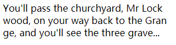
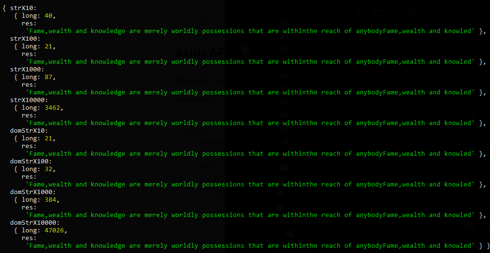

# EllipsisText

> A generator that gets the minimum content that corresponds to the height of an element

## Installation

npm:

```sh
npm install ellipsis-text --save-dev
```

## Usage example

```html
<div id="ellipsis"></div>
```

```js
import EllipsisText from 'ellipsis-text'
new EllipsisText(document.querySelector('#ellipsis'), {
  str:
    'Fame,wealth and knowledge are merely worldly possessions that are withinthe reach of anybodyFame,wealth and knowledge are merely worldly possessions that are withinthe reach of anybodyFame',
  callback:function(res){
      console.log(res) 
      // output:Fame,wealth and knowledge are merely worldly possessions that are withinthe reach of anybodyFame,wealth and knowled
  }
})
```

you can use it to generate text with ellipsis

```js
var ellipsisText = new EllipsisText(document.querySelector('#ellipsis'), {
  str:
    "You'll pass the churchyard, Mr Lockwood, on your way back to the Grange, and you'll see the three graverestones close to the moor. Catherine's",
  callback:function(res){
      console.log(this.dotdotdot()) 
      // output:You'll pass the churchyard, Mr Lockwood, on your way back to the Grange, and you'll see the three grave...
  }
})
```



## EllipsisText API

```js
new EllipsisText(
  HTMLElement,
{
  str: String,
  row: Number,
  callback:function(res){}
})
```

## Tips

EllipsisText used canvas to determine the number of lines to be intercepted

If you pass in HTML, it deletes the nodes one by one to find the last text node that exceeds the height

function dotdotdot just replace last three letter, but you can use [dotdotdot.js](http://dotdotdot.frebsite.nl/) to do the following or rewrite this function

## Perfonmance

The following is an EllipsisText performance test (in ms)




## Development setup

```sh
npm install

npm run dev

npm run test
```

## Release History

- 1.0.0
  - The first release

## Meta

Mater1996 – bxh8640@gmail.com

Distributed under the MIT license. See `LICENSE` for more information.

[LICENSE](https://github.com/Mater1996/ellipsis-text/blob/master/LICENSE)

## Contributing

1. Fork it (<https://github.com/Mater1996/ellipsis-text>)
2. Create your feature branch (`git checkout -b feature/fooBar`)
3. Commit your changes (`git commit -am 'Add some fooBar'`)
4. Push to the branch (`git push origin feature/fooBar`)
5. Create a new Pull Request
